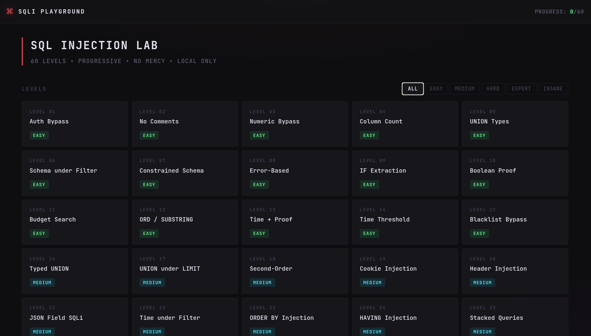

# SQLi Playground

**Local, offline SQL Injection CTF lab** — 60 progressive levels on MariaDB / MySQL.

Real vulnerable queries. Isolated databases per level. Random flags per install. Sequential unlock.

> Educational use only. Run on your own machine. **Do not expose this lab to the internet.**

[](https://you-in-you.github.io/sqli-playground/demo/)
[](./version/version.json)
[](#license)

---

## Preview



Static UI preview (no database): **[Live Demo](https://you-in-you.github.io/sqli-playground/demo/)**  
Level 01 is interactive in the browser; the full lab needs a local install.

---

## Features

- **60 levels** — easy → medium → hard → expert → insane
- **Real SQLi** — intentionally vulnerable handlers, not string matching games
- **Isolated DBs** — `sqli_level_01` … `sqli_level_60`; dumping one level does not leak later flags
- **Random flags** — `CTF{sql1_lXX_........}` generated at setup
- **Safe control plane** — progress, history, and flag checks use parameterized queries
- **Attack history** — review payloads that solved each level
- **Dark CTF UI** — difficulty-colored cards, filters, progressive unlock
- **CLI toolkit** — `./run.sh` for ensure / install / reinstall / uninstall / status
- **Update check** — compares local version with `version/version.json` on GitHub

---

## Requirements

| Stack | Version |
|--------|---------|
| Python | 3.10+ |
| MariaDB | 10.5+ **or** MySQL 8+ |
| Docker | optional (Compose v2) |

---

## Quick start (local)

### 1. Clone

```bash
git clone https://github.com/you-in-you/sqli-playground.git
cd sqli-playground
```

### 2. Python environment

```bash
python3 -m venv .venv
source .venv/bin/activate          # Windows: .venv\Scripts\activate
pip install -r requirements.txt
```

### 3. Database user

On many Linux distros, `root` uses socket auth. Create a dedicated user:

```bash
sudo mariadb -u root
```

```sql
CREATE USER IF NOT EXISTS 'ctf'@'localhost' IDENTIFIED BY 'ctfpass';
GRANT ALL PRIVILEGES ON *.* TO 'ctf'@'localhost' WITH GRANT OPTION;
FLUSH PRIVILEGES;
EXIT;
```

### 4. Configure

Edit `config.json` if needed:

```json
{
  "DB_HOST": "127.0.0.1",
  "DB_PORT": 3306,
  "DB_USER": "ctf",
  "DB_PASS": "ctfpass",
  "SECRET_KEY": "change-this-to-a-long-random-string",
  "HOST": "127.0.0.1",
  "PORT": 7080
}
```

Bind `HOST` to `127.0.0.1` for local-only access.

### 5. Run

```bash
chmod +x run.sh
./run.sh
```

This ensures databases (non-destructive), then starts Flask. Open the URL printed in the terminal (default `http://127.0.0.1:7080`).

---

## Docker

Docker runs **MariaDB + the web app** together. No local MariaDB install required.

### Start

```bash
git clone https://github.com/you-in-you/sqli-playground.git
cd sqli-playground
docker compose up --build
```

- App: [http://127.0.0.1:5000](http://127.0.0.1:5000)
- DB: MariaDB on port `3306` (user/password from `docker-compose.yml`)

On first start, `scripts/setup_db.py` creates the 60 level databases and random flags.

### Useful commands

```bash
docker compose up --build -d    # detached
docker compose logs -f web      # app logs
docker compose down             # stop containers
docker compose down -v          # stop and delete DB volume (full wipe)
```

### Notes

- Default compose uses root credentials inside the stack for setup simplicity. Change passwords before any shared environment.
- `flags.json` is bind-mounted; do not commit real flags (see `.gitignore`).
- For day-to-day local work without containers, prefer `./run.sh` + system MariaDB.

---

## CLI (`./run.sh`)

| Command | What it does |
|---------|----------------|
| `./run.sh` / `./run.sh start` | Ensure DBs, then start the lab server |
| `./run.sh ensure` | Create missing DBs/tables; keep flags & progress |
| `./run.sh install` | Drop lab DBs + flags, full rebuild |
| `./run.sh reinstall` | Same as install |
| `./run.sh uninstall` | Drop lab DBs + flags only (no rebuild) — come back later |
| `./run.sh status` | Version, databases, progress |
| `./run.sh -y install` | Skip confirmation prompts |
| `./run.sh help` | Show help |

Examples:

```bash
./run.sh status
./run.sh install
./run.sh -y reinstall
./run.sh uninstall
```

Environment overrides:

| Variable | Effect |
|----------|--------|
| `SQLI_CTF_FORCE_RESET=1` | Auto-confirm destructive ops / migrations |
| `SQLI_CTF_SKIP_RESET=1` | Skip migrations |
| `SQLI_CTF_SKIP_UPDATE=1` | Skip remote version check |
| `SQLI_CTF_CONFIG=path` | Alternate config file |

---

## How progress works

- Levels unlock **in order**. You cannot skip ahead.
- Each level has its own database (`sqli_level_XX`).
- Submitting the correct flag (from that level’s `secrets` table) marks the level solved and unlocks the next one.
- Flags are unique per installation; sharing flags across machines will not work.

---

## Project layout

```text
.
├── app/
│   ├── main.py           # Flask routes & API
│   ├── config.py         # Loads config.json / env
│   ├── db.py             # Progress, history, flag check
│   ├── levels/
│   │   ├── handlers.py   # Intentionally vulnerable level handlers
│   │   └── __init__.py   # Level metadata & registry
│   ├── static/           # CSS / JS
│   └── templates/        # Dashboard UI
├── scripts/
│   └── setup_db.py       # DB toolkit (ensure / install / uninstall / …)
├── demo/                 # Static GitHub Pages preview
├── version/
│   └── version.json      # Published version + changelog
├── config.json           # Local settings
├── docker-compose.yml
├── Dockerfile
├── run.sh                # Main entrypoint
├── requirements.txt
└── README.md
```

---

## Reset & maintenance

**Progress only** (SQL):

```sql
UPDATE sqli_ctf_meta.progress SET current_level = 1, solved = '';
TRUNCATE TABLE sqli_ctf_meta.attack_history;
```

**New flags + clean progress:**

```bash
./run.sh install
```

**Remove lab data from MySQL (keep source tree):**

```bash
./run.sh uninstall
```

---

## Common issues

| Problem | Fix |
|---------|-----|
| `Access denied for user 'root'@'localhost'` | Use the `ctf` / `ctfpass` user, or enable password auth for root |
| `Can't connect to MySQL server` | Start MariaDB: `sudo systemctl start mariadb` |
| `ModuleNotFoundError: flask` | Activate venv and `pip install -r requirements.txt` |
| Port already in use | Change `PORT` in `config.json` |
| Docker DB not ready | Wait for healthcheck; check `docker compose logs db` |

---

## Security notes

- **Local lab only.** Prefer `"HOST": "127.0.0.1"` in `config.json`.
- Challenge endpoints are **intentionally vulnerable**.
- Meta DB operations (progress, history, flag verification) use **parameterized queries**.
- Do not commit `flags.json`.
- Change `SECRET_KEY` for your install.
- Never publish this service on a public IP.

---

## Updates

On `./run.sh ensure` / `install` / `status`, the toolkit may fetch:

`https://raw.githubusercontent.com/you-in-you/sqli-playground/main/version/version.json`

If a newer version is published, you will see the changelog and a reminder to `git pull`.

---

## License

Educational use. Use responsibly.

---

## Author

[you-in-you](https://github.com/you-in-you) · [Repository](https://github.com/you-in-you/sqli-playground)
