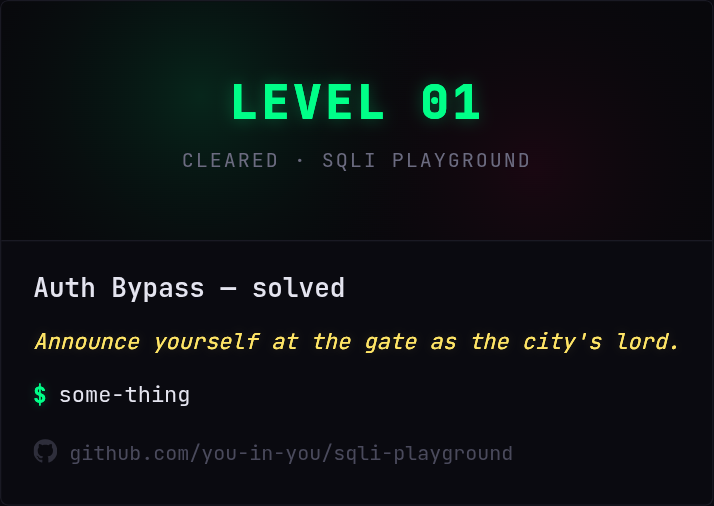
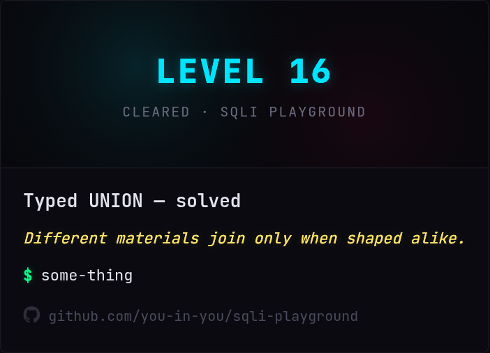
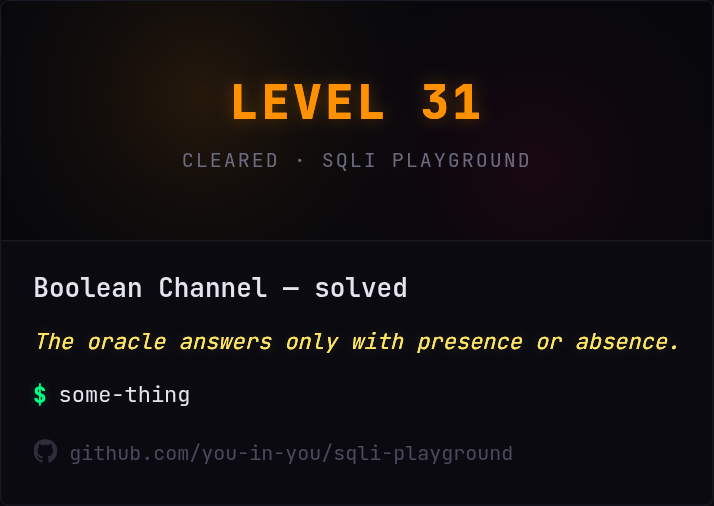
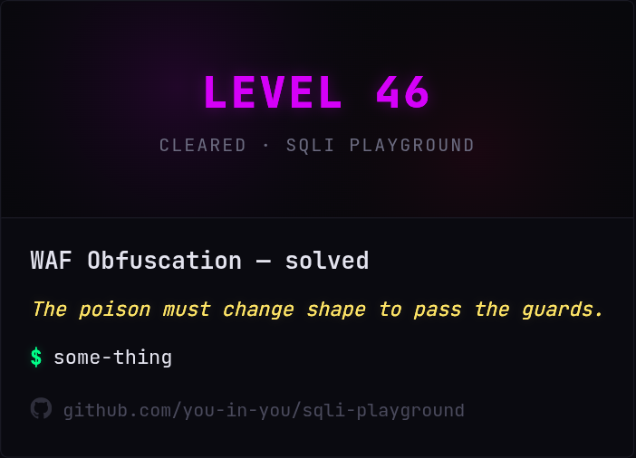
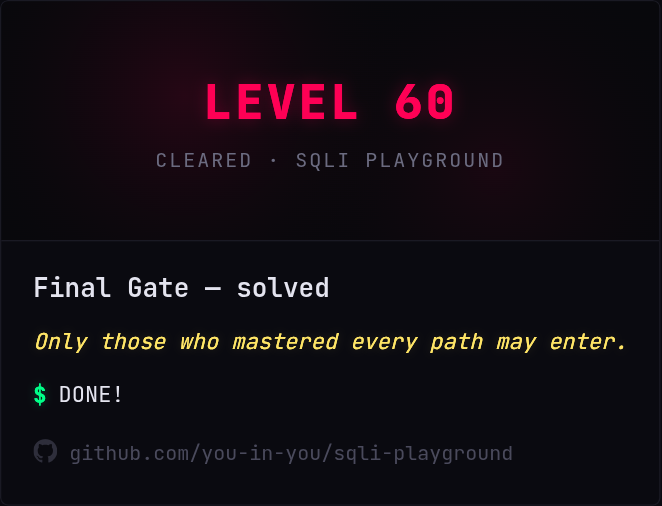

# SQLi Playground

**Local, offline SQL Injection CTF lab** — 60 progressive levels on MariaDB / MySQL.

Real vulnerable queries. Isolated databases per level. Random flags per install. Sequential unlock.

> Educational use only. Run on your own machine. **Do not expose this lab to the internet.**

[](https://you-in-you.github.io/sqli-playground/demo/)
[](./version/version.json)
[](#license)

---

## Preview


Static UI preview (no database): **[Live Demo](https://you-in-you.github.io/sqli-playground/demo/)**  
Level 01 is interactive in the browser; the full lab needs a local install.

### Share cards

After clearing a level you can export a difficulty-colored share card (six layouts). Examples by tier:

| Easy | Medium | Hard |
|:----:|:------:|:----:|
|  |  |  |

| Expert | Insane |
|:------:|:------:|
|  |  |

---

## Features

- **60 levels** — easy → medium → hard → expert → insane
- **Real SQLi** — intentionally vulnerable handlers, not string matching games
- **Isolated DBs** — `sqli_level_01` … `sqli_level_60`; dumping one level does not leak later flags
- **Random flags** — `CTF{sql1_lXX_........}` generated at setup
- **Safe control plane** — progress, history, and flag checks use parameterized queries
- **Attack history** — review payloads that solved each level
- **Share cards** — export a PNG after a clear (styles + difficulty colors)
- **Dark CTF UI** — difficulty-colored cards, filters, progressive unlock
- **CLI toolkit** — `./run.sh` for local **and** Docker workflows
- **Non-blocking update check** — after the dashboard loads, the UI compares the local version with GitHub `version/version.json` and shows a dismissible modal if a newer release exists (launch is never stalled by a slow network)

---

## Requirements

| Stack | Version |
|--------|---------|
| Python | 3.10+ |
| MariaDB | 10.5+ **or** MySQL 8+ |
| Docker | optional (Compose v2) |

---

## Quick start (local)

### 1. Clone

```bash
git clone https://github.com/you-in-you/sqli-playground.git
cd sqli-playground
```

### 2. Python environment

```bash
python3 -m venv .venv
source .venv/bin/activate          # Windows: .venv\Scripts\activate
pip install -r requirements.txt
```

### 3. Database user

On many Linux distros, `root` uses socket auth. Create a dedicated user:

```bash
sudo mariadb -u root
```

```sql
CREATE USER IF NOT EXISTS 'ctf'@'localhost' IDENTIFIED BY 'ctfpass';
GRANT ALL PRIVILEGES ON *.* TO 'ctf'@'localhost' WITH GRANT OPTION;
FLUSH PRIVILEGES;
EXIT;
```

### 4. Configure

Edit `config.json` if needed:

```json
{
  "DB_HOST": "127.0.0.1",
  "DB_PORT": 3306,
  "DB_USER": "ctf",
  "DB_PASS": "ctfpass",
  "SECRET_KEY": "change-this-to-a-long-random-string",
  "HOST": "127.0.0.1",
  "PORT": 7080
}
```

Bind `HOST` to `127.0.0.1` for local-only access.

### 5. Run

```bash
chmod +x run.sh
./run.sh
```

This ensures databases (non-destructive), then starts Flask. Open the URL printed in the terminal (default `http://127.0.0.1:7080`).

---

## Docker

Docker runs **MariaDB + the web app** together. No local MariaDB install required.

### Start / stop (via `./run.sh`)

```bash
git clone https://github.com/you-in-you/sqli-playground.git
cd sqli-playground

./run.sh docker up          # build + start (detached)
# Lab → http://127.0.0.1:5000

./run.sh docker logs        # follow web logs
./run.sh docker down        # stop
./run.sh docker down -v     # stop and delete DB volume (full wipe)
```

Equivalent Compose commands still work:

```bash
docker compose up --build -d
docker compose logs -f web
docker compose down
```

### Lab maintenance inside Docker

Same verbs as local, prefixed with `docker`:

| Goal | Command |
|------|---------|
| Status | `./run.sh docker status` |
| Ensure DBs | `./run.sh docker ensure` |
| Full rebuild | `./run.sh docker -y install` |
| Uninstall lab data | `./run.sh docker -y uninstall` |
| Shell in web | `./run.sh docker shell` |

These run `scripts/setup_db.py` inside the `web` container (`docker compose exec` or a one-off `run` if the service is down).

### Notes

- Bind mounts use the `:Z` suffix for SELinux (Fedora/RHEL). On hosts without SELinux, Docker ignores it.
- Default compose credentials are for local labs only — change passwords before any shared environment.
- `flags.json` is bind-mounted; do not commit real flags.
- Update checks in the browser talk to GitHub; the `version/` folder does not need a separate volume mount.
- For day-to-day work without containers, prefer `./run.sh` + system MariaDB.

---

## CLI (`./run.sh`)

### Local

| Command | What it does |
|---------|----------------|
| `./run.sh` / `./run.sh start` | Ensure DBs, then start the lab server |
| `./run.sh ensure` | Create missing DBs/tables; keep flags & progress |
| `./run.sh install` | Drop lab DBs + flags, full rebuild |
| `./run.sh reinstall` | Same as install |
| `./run.sh uninstall` | Drop lab DBs + flags only (no rebuild) |
| `./run.sh status` | Version, databases, progress |
| `./run.sh -y install` | Skip confirmation prompts |
| `./run.sh help` | Show help |

### Docker

| Command | What it does |
|---------|----------------|
| `./run.sh docker up` | Build images and start `db` + `web` |
| `./run.sh docker down` | Stop containers |
| `./run.sh docker down -v` | Stop and remove the DB volume |
| `./run.sh docker logs` | Tail web logs |
| `./run.sh docker ps` | Show compose services |
| `./run.sh docker shell` | Shell inside the web container |
| `./run.sh docker status` | `setup_db status` in the container |
| `./run.sh docker ensure` | `setup_db ensure` in the container |
| `./run.sh docker install` | `setup_db install` in the container |
| `./run.sh docker -y install` | Same, non-interactive |
| `./run.sh docker uninstall` | `setup_db uninstall` in the container |

Examples:

```bash
./run.sh status
./run.sh install
./run.sh -y reinstall

./run.sh docker up
./run.sh docker status
./run.sh docker -y install
./run.sh docker logs
./run.sh docker down
```

Environment overrides:

| Variable | Effect |
|----------|--------|
| `SQLI_CTF_FORCE_RESET=1` | Auto-confirm destructive ops / migrations |
| `SQLI_CTF_SKIP_RESET=1` | Skip migrations |
| `SQLI_CTF_SKIP_UPDATE=1` | Skip remote version check in CLI `status` |
| `SQLI_CTF_VERSION_URL=…` | Override `version.json` URL |
| `SQLI_CTF_CONFIG=path` | Alternate config file |
| `APP_VERSION` | Override local app version string |
| `VERSION_CHECK_TIMEOUT` | HTTP timeout for version check (seconds) |

---

## How progress works

- Levels unlock **in order**. You cannot skip ahead.
- Each level has its own database (`sqli_level_XX`).
- Submitting the correct flag (from that level’s `secrets` table) marks the level solved and unlocks the next one.
- Flags are unique per installation; sharing flags across machines will not work.

---

## Project layout

```text
.
├── app/
│   ├── main.py           # Flask routes & API (incl. /api/version)
│   ├── config.py         # Loads config.json / env
│   ├── db.py             # Progress, history, flag check
│   ├── levels/
│   │   ├── handlers.py   # Intentionally vulnerable level handlers
│   │   └── __init__.py   # Level metadata & registry
│   ├── static/           # CSS / JS (update modal)
│   └── templates/        # Dashboard UI
├── scripts/
│   └── setup_db.py       # DB toolkit (ensure / install / uninstall / …)
├── demo/                 # Static GitHub Pages preview
├── version/
│   └── version.json      # Published version + changelog (GitHub)
├── pictures/             # README screenshots & share-card samples
├── config.json           # Local settings
├── docker-compose.yml
├── Dockerfile
├── run.sh                # Local + Docker entrypoint
├── requirements.txt
└── README.md
```

---

## Reset & maintenance

**Progress only** (SQL):

```sql
UPDATE sqli_ctf_meta.progress SET current_level = 1, solved = '';
TRUNCATE TABLE sqli_ctf_meta.attack_history;
```

**New flags + clean progress:**

```bash
./run.sh install
# Docker:
./run.sh docker -y install
```

**Remove lab data from MySQL (keep source tree):**

```bash
./run.sh uninstall
# Docker:
./run.sh docker -y uninstall
```

---

## Common issues

| Problem | Fix |
|---------|-----|
| `Access denied for user 'root'@'localhost'` | Use the `ctf` / `ctfpass` user, or enable password auth for root |
| `Can't connect to MySQL server` | Start MariaDB: `sudo systemctl start mariadb` |
| `ModuleNotFoundError: flask` | Activate venv and `pip install -r requirements.txt` |
| Port already in use | Change `PORT` in `config.json` |
| Docker DB not ready | Wait for healthcheck; `./run.sh docker logs` or `docker compose logs db` |
| Permission denied on bind mounts (Fedora) | Compose already uses `:Z`; ensure SELinux is not blocking Docker |
| Update modal never appears | Normal if you are on the latest version, offline, or dismissed it this session |

---

## Security notes

- **Local lab only.** Prefer `"HOST": "127.0.0.1"` in `config.json`.
- Challenge endpoints are **intentionally vulnerable**.
- Meta DB operations (progress, history, flag verification) use **parameterized queries**.
- Do not commit `flags.json`.
- Change `SECRET_KEY` for your install.
- Never publish this service on a public IP.

---

## Updates

Version checks **do not block startup**.

1. **Web UI** — After the dashboard loads, the client calls `/api/version/check`. The server fetches:

   `https://raw.githubusercontent.com/you-in-you/sqli-playground/main/version/version.json`

   with a short timeout. If a newer version exists, a dismissible modal shows the changelog and a link to the repository. Closing it remembers the remote version for the browser session.

2. **CLI** — `./run.sh status` (or `./run.sh docker status`) may still print a remote version summary. `ensure` / `install` no longer wait on the network for this check.

To publish a release: bump `APP_VERSION` in code/config, update `version/version.json` (`version` + `changes`), and push to `main`.

---

## License

Educational use. Use responsibly.

---

## Author

[you-in-you](https://github.com/you-in-you) · [Repository](https://github.com/you-in-you/sqli-playground)
